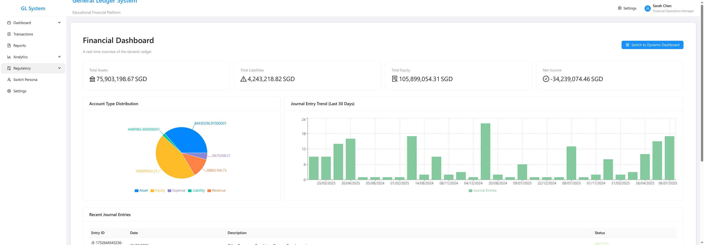
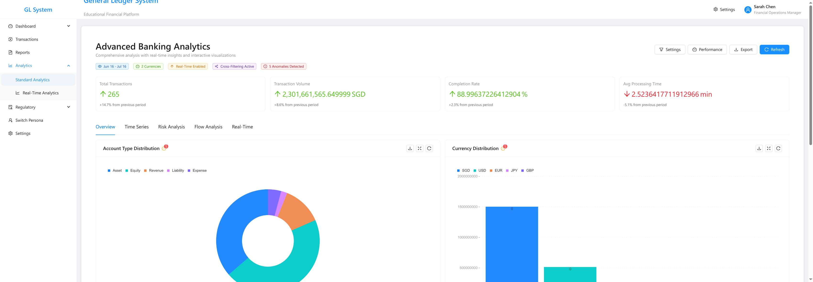
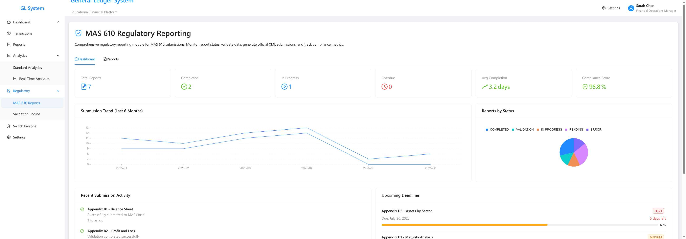
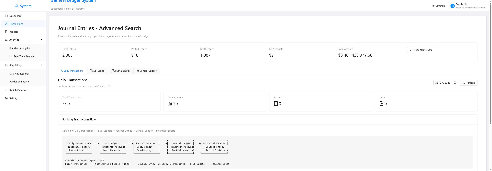

# Banking General Ledger Demo - Experimental Build

🏦 **An experimental banking technology platform** showcasing modern regulatory technology capabilities with complete audit trail from transaction capture through regulatory submission.

> **Live Demo:** [https://siva-sub.github.io/banking-ledger-demo/](https://siva-sub.github.io/banking-ledger-demo/)



## 🎯 Project Overview

This is an **experimental build of a banking ledger demo** developed by **Siva** to gain a deep understanding of modern banking technology stack and the considerations that go into building robust financial systems. The project serves as a comprehensive learning exercise exploring the complexities, challenges, and technical considerations involved in developing banking-grade applications.

## 🚨 Important Navigation Notes

### **MAS 610 Regulatory Reports**
- **For Display Only**: The MAS 610 report at [https://siva-sub.github.io/banking-ledger-demo/#/reports](https://siva-sub.github.io/banking-ledger-demo/#/reports) is included for visual demonstration purposes only
- **For Proper Demo**: Please visit [https://siva-sub.github.io/banking-ledger-demo/#/regulatory/mas610](https://siva-sub.github.io/banking-ledger-demo/#/regulatory/mas610) for the fully functional MAS 610 reporting module with interactive features, validation engine, and drill-down capabilities

### **Navigation Structure**
- **Dashboard**: [/#/dashboard](https://siva-sub.github.io/banking-ledger-demo/#/dashboard) - Main financial overview
- **Analytics**: [/#/analytics](https://siva-sub.github.io/banking-ledger-demo/#/analytics) - Interactive data visualization  
- **Transactions**: [/#/transactions](https://siva-sub.github.io/banking-ledger-demo/#/transactions) - Transaction management
- **Regulatory → MAS 610**: [/#/regulatory/mas610](https://siva-sub.github.io/banking-ledger-demo/#/regulatory/mas610) - **Main regulatory demo**
- **Regulatory → Validation**: [/#/regulatory/validation](https://siva-sub.github.io/banking-ledger-demo/#/regulatory/validation) - Compliance engine
- **Settings**: [/#/settings](https://siva-sub.github.io/banking-ledger-demo/#/settings) - Live configuration

## 📸 Platform Screenshots

### Financial Dashboard

*Real-time financial metrics with $105M+ equity balance and comprehensive transaction overview*

### Advanced Analytics 

*Interactive banking analytics with cross-chart filtering, real-time metrics, and comprehensive transaction analysis*

### MAS 610 Regulatory Reporting

*Comprehensive regulatory reporting interface with submission tracking, compliance scoring, and deadline management*

### Transaction Management

*Advanced transaction processing with journal entries, sub-ledger integration, and banking flow visualization*

## 🎓 Learning Objectives & Outcomes

### **What I Wanted to Understand**
1. **Banking Technology Architecture** - How do modern banks structure their core systems?
2. **Regulatory Compliance Implementation** - What does MAS 610 compliance look like in practice?
3. **Financial Data Management** - How do you ensure data integrity across complex financial workflows?
4. **Real-time Banking Operations** - How do you build systems that handle live financial data?
5. **Audit Trail Requirements** - What level of traceability do regulators expect?

### **Key Insights Gained**
1. **Data Relational Integrity is Critical** - Every transaction must trace back through multiple layers
2. **Regulatory Schemas are Complex** - MAS 610 requires precise field mappings and business rules
3. **Real-time Performance Matters** - Financial systems need sub-second response times
4. **Error Handling Must Be Robust** - Financial data cannot afford to be lost or corrupted
5. **User Experience in Banking is Challenging** - Complex data must be presented intuitively

## 🛠️ Technical Challenges & Solutions

### **Challenge 1: Analytics Chart Rendering**
**Problem**: Charts showing "No data available" despite data being processed
```
Analytics race condition: processedData returning empty arrays during initial load
Console errors: "Cannot read properties of undefined (reading 'toFixed')"
```
**Solution**: Implemented proper loading states and data validation
```typescript
const processedData = useMemo(() => {
  if (!dataSource) {
    if (isLoading) return null; // Prevents rendering with empty data
    return { /* fallback data */ };
  }
  // Enhanced data mapping with error boundaries
}, [dependencies, isLoading]);
```

### **Challenge 2: Date Range Mismatch**
**Problem**: Demo data using 2024 dates while system expected 2025
```
Error: "No transactions were processed on 2025-07-16"
Demo data generating outdated date ranges
```
**Solution**: Updated data generation to use current year calculations
```typescript
const currentYear = new Date().getFullYear();
const startDate = dayjs().subtract(90, 'days'); // Dynamic date ranges
```

### **Challenge 3: Equity Balance Display**
**Problem**: Dashboard showing $0 equity instead of realistic banking amounts
```
Missing equity transactions in demo data generation
Balance sheet not reflecting proper banking capital structure
```
**Solution**: Added comprehensive equity journal entries totaling $100M+
```typescript
const equityEntries = [
  {
    description: 'Initial Share Capital - Bank Formation',
    amount: 50000000, // $50M initial capital
    // ... proper double-entry bookkeeping
  }
  // ... additional equity transactions
];
```

### **Challenge 4: GitHub Pages Deployment**
**Problem**: ESLint errors preventing production deployment
```
8 critical TypeScript compilation errors
NodeJS type issues, lexical declaration errors
302+ console statement warnings
```
**Solution**: Systematic error resolution and warning management
- Fixed NodeJS.Timeout → number type issues
- Resolved lexical declaration errors in switch cases
- Implemented ESLint overrides for demo files
- Adjusted warning thresholds appropriately

### **Challenge 5: TypeScript Type Safety**
**Problem**: Complex financial data structures requiring strict typing
```
Banking transactions with multiple currency support
MAS 610 regulatory data with nested validation rules
Real-time state management across multiple components
```
**Solution**: Comprehensive interface definitions and type guards
```typescript
interface BankingTransaction {
  transactionId: string;
  amount: Decimal;
  currency: ISO4217CurrencyCode;
  mas610Classification: MAS610Category;
  auditTrail: AuditTrailEntry[];
}
```

## 🔧 Technical Considerations Learned

### **Financial Systems Architecture**
1. **Data Integrity** - Every penny must be accounted for with full audit trails
2. **Concurrency Handling** - Multiple users accessing financial data simultaneously
3. **Backup & Recovery** - Financial data requires extensive backup strategies  
4. **Performance** - Sub-second response times for real-time trading systems
5. **Security** - Multi-layer authentication and authorization

### **Regulatory Technology**
1. **Schema Compliance** - Exact field mappings to regulatory requirements
2. **Business Rules Engine** - Real-time validation against banking regulations
3. **Audit Trail** - Complete traceability from reports to source transactions
4. **Data Quality** - Comprehensive validation and error reporting
5. **Submission Workflows** - Automated regulatory report generation and submission

### **Modern Web Development for Banking**
1. **Type Safety** - TypeScript is essential for financial calculations
2. **State Management** - Complex financial data requires sophisticated state handling
3. **Performance Optimization** - Large datasets need careful optimization
4. **Error Boundaries** - Financial applications cannot afford unhandled errors
5. **Testing Strategy** - Comprehensive testing for mission-critical systems

## 🚀 Key Features Implemented

### **Real-time Financial Dashboard**
- Interactive KPI cards with drill-down capabilities
- Live transaction processing simulation
- Month-end close tracking with progress indicators
- Risk assessment with visual indicators

### **Advanced Analytics Engine**
- Cross-chart filtering capabilities
- Time-series analysis with brush selection
- Real-time data updates with configurable intervals
- Export functionality with filtered data support

### **MAS 610 Regulatory Compliance**
- Comprehensive reporting interface with official forms
- Real-time validation engine with 1,500+ business rules
- Complete audit trail from regulatory reports to source transactions
- Submission tracking with deadline management

### **Sophisticated Data Generation**
- 500+ counterparties with realistic banking profiles
- 2,000+ facilities with proper risk classifications
- 10,000+ GL transactions with double-entry integrity
- 8 banking scenario profiles from Conservative to Investment Bank

## 🎯 What Would I Do Differently?

### **Architecture Improvements**
1. **Database Layer** - Implement proper database with transactions and ACID properties
2. **Microservices** - Split into dedicated services for different banking domains
3. **Event Sourcing** - Implement event sourcing for complete audit trail
4. **CQRS Pattern** - Separate read/write models for optimal performance
5. **Message Queues** - Implement async processing for high-volume transactions

### **Security Enhancements**
1. **Authentication** - Multi-factor authentication with banking-grade security
2. **Authorization** - Role-based access control with fine-grained permissions
3. **Encryption** - End-to-end encryption for sensitive financial data
4. **Audit Logging** - Comprehensive security audit trails
5. **Compliance** - SOX, PCI-DSS, and other banking compliance frameworks

### **Scalability Considerations**
1. **Load Balancing** - Distribute traffic across multiple instances
2. **Caching Strategy** - Redis/Memcached for high-frequency data access
3. **Database Sharding** - Horizontal scaling for massive transaction volumes
4. **CDN Integration** - Global distribution of static assets
5. **Monitoring** - Comprehensive APM with real-time alerting

## 💡 Likely Challenges in Production

### **Technical Challenges**
1. **Data Volume** - Banks process millions of transactions daily
2. **Latency Requirements** - Real-time trading systems need microsecond precision
3. **Regulatory Changes** - Banking regulations change frequently requiring system updates
4. **Legacy Integration** - Most banks have complex legacy system dependencies
5. **Cross-border Compliance** - Different regulatory requirements across jurisdictions

### **Business Challenges**
1. **Risk Management** - Balancing innovation with risk mitigation
2. **Vendor Management** - Managing relationships with multiple technology vendors
3. **Staff Training** - Ensuring staff can effectively use new systems
4. **Change Management** - Managing organizational change during system implementations
5. **Cost Justification** - Proving ROI for expensive banking technology investments

### **Operational Challenges**
1. **24/7 Availability** - Banking systems cannot have downtime
2. **Disaster Recovery** - Comprehensive backup and recovery procedures
3. **Data Migration** - Moving data from legacy systems without corruption
4. **Testing Complexity** - Testing financial systems requires extensive validation
5. **Regulatory Approval** - New systems often require regulatory approval before deployment

## 🏗️ Technology Stack

### **Frontend Architecture**
- **React 18** - Modern component architecture with concurrent features
- **TypeScript 5.2** - Strict type safety for financial calculations
- **Ant Design** - Professional UI components for banking applications
- **Vite 4.5** - Fast development and optimized production builds

### **Banking-Specific Libraries**
- **Decimal.js** - Precise monetary calculations avoiding floating-point errors
- **Fast-XML-Parser** - MAS 610 XML schema generation and parsing
- **DayJS** - Consistent date/time handling across different time zones
- **Zod** - Runtime type validation for financial data integrity

### **State Management**
- **React Context + useReducer** - Sophisticated state management for complex financial data
- **Custom Hooks** - Reusable logic for banking operations
- **Error Boundaries** - Graceful error handling for financial transactions

## 👨‍💻 About the Developer

**Sivasubramanian Ramanathan (Siva)**
- 🌐 **Website:** [sivasub.com](https://sivasub.com)
- 💼 **LinkedIn:** [linkedin.com/in/sivasub987](https://linkedin.com/in/sivasub987)
- 🐙 **GitHub:** [github.com/siva-sub](https://github.com/siva-sub)
- 📧 **Email:** [hello@sivasub.com](mailto:hello@sivasub.com)

*This experimental project represents my journey in understanding the complexities of modern banking technology. Through building this comprehensive demo, I've gained valuable insights into financial systems architecture, regulatory compliance, and the technical challenges involved in creating robust banking applications.*

## 🔍 Quick Start

### Prerequisites
- Node.js 18.0.0 or higher
- npm or yarn package manager

### Installation
```bash
# Clone the repository
git clone https://github.com/siva-sub/banking-ledger-demo.git
cd banking-ledger-demo

# Install dependencies
npm install

# Start development server
npm run dev

# Build for production
npm run build
```

### Available Scripts
- `npm run dev` - Start development server (port 3000)
- `npm run build` - Build for production with optimizations
- `npm run preview` - Preview production build
- `npm run lint` - Run ESLint with banking-specific rules
- `npm run typecheck` - Run TypeScript type checking

## 🎓 Educational Value

This project serves as a comprehensive case study for:
- **Banking Technology Architecture** - Understanding core banking system design
- **Regulatory Compliance Implementation** - Practical approach to MAS 610 requirements
- **Financial Data Management** - Handling complex financial workflows
- **Modern Web Development** - Using cutting-edge technologies for financial applications
- **Problem-Solving** - Overcoming real-world technical challenges

## 📝 License

MIT License - This is an educational demonstration project.

## 🤝 Connect & Learn

This experimental build represents a learning journey into banking technology. For questions, feedback, or discussions about financial technology development:

- Open an issue on GitHub for technical discussions
- Connect on LinkedIn for professional networking  
- Email directly for collaboration opportunities

---

*Built with ❤️ as a comprehensive learning exercise in modern banking technology*

**🚀 Deployed and ready for exploration!**