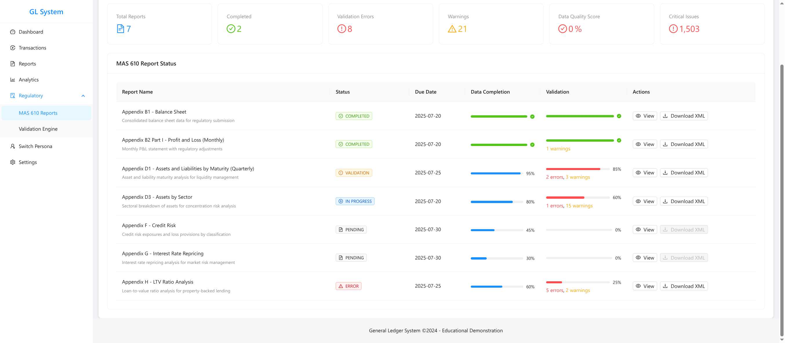

# Banking General Ledger Demo

🏦 **A sophisticated banking technology platform** showcasing modern regulatory technology capabilities with complete audit trail from transaction capture through regulatory submission.

> **Live Demo:** [https://siva-sub.github.io/banking-ledger-demo/](https://siva-sub.github.io/banking-ledger-demo/)


## 🎯 Enhanced Features

### 🚀 **Interactive Dashboard** 
- **Real-time Financial Ratios** - Clickable KPI cards with drill-down details and trend indicators
- **Month-End Close Tracking** - Interactive progress monitoring with task breakdowns
- **Live Transaction Flow** - Real-time charts showing transaction patterns
- **Data Quality Alerts** - Proactive compliance issue detection

### 💼 **Advanced Transaction Management**
- **150 Realistic Transactions** - Professional banking data with ISO 20022 message types
- **Advanced Filtering** - Multi-criteria search with debounced performance
- **Real-time Status Updates** - Live transaction processing simulation
- **Export Capabilities** - CSV, Excel, PDF export with audit trail
- **Risk Scoring** - Visual risk assessment with progress indicators

### 📊 **Interactive Analytics Dashboard**
- **Cross-Chart Filtering** - Click pie charts to filter all visualizations
- **Time-Series Controls** - Interactive timeline with brush selection
- **Real-time Data Updates** - Live mode with configurable refresh intervals
- **Responsive Design** - Optimized for desktop, tablet, and mobile
- **Advanced Export** - Multiple format support with filtered data

### ⚙️ **Live Configuration Center**
- **8 Banking Scenario Profiles** - From Conservative to Investment Bank
- **Real-time System Effects** - Settings changes immediately propagate
- **Advanced Demo Data Generation** - 500+ counterparties, 2000+ facilities, 10,000+ transactions
- **Performance Monitoring** - Real-time metrics and resource usage

### 📋 **Regulatory Compliance**
- **MAS 610 Reporting** - Official forms with XML generation and drill-down capabilities
- **Validation Engine** - Real-time business rules and schema validation with 1,500+ validation issues
- **Complete Audit Trail** - Unbreakable traceability from regulatory reports to source transactions
- **Data Quality Scoring** - Automated compliance assessment and issue prioritization

## 🚀 Quick Start

### Prerequisites
- Node.js 18.0.0 or higher
- npm or yarn package manager

### Installation
```bash
# Clone the repository
git clone https://github.com/siva-sub/banking-ledger-demo.git
cd banking-ledger-demo

# Install dependencies
npm install

# Start development server
npm run dev

# Build for production
npm run build
```

### Available Scripts
- `npm run dev` - Start development server (port 3000)
- `npm run build` - Build for production with optimizations
- `npm run preview` - Preview production build
- `npm run lint` - Run ESLint with banking-specific rules
- `npm run typecheck` - Run TypeScript type checking
- `npm run format` - Format code with Prettier

### 🔧 **Local Development**
The platform runs on `http://localhost:3000/banking-ledger-demo/` with HashRouter configured for GitHub Pages deployment.

**Key Features to Test:**
- **Interactive Dashboard** - Click financial ratio cards for drill-down
- **Transaction Management** - Use advanced filters and real-time updates
- **Analytics** - Test cross-chart filtering and time-series controls
- **Settings** - Try different banking scenario profiles
- **MAS 610 Reports** - Test drill-down from reports to source data

## 🏗️ Technology Stack

- **Frontend**: React 18 + TypeScript
- **UI Framework**: Ant Design
- **State Management**: React Context + useReducer
- **Routing**: React Router DOM
- **Build Tool**: Vite
- **Styling**: CSS-in-JS with Ant Design theming

## 📊 Demo Highlights

### 🖼️ **Platform Screenshots**

#### **Dashboard Overview**

*Real-time financial ratios, month-end close status, and regulatory reporting overview*

#### **Transaction Management**

*Advanced transaction filtering with ISO 20022 message types and real-time status updates*

#### **Analytics & Insights**

*Interactive charts with cross-filtering and performance metrics*

#### **MAS 610 Regulatory Reports**

*Official regulatory reporting interface with drill-down capabilities*

#### **MAS 610 Drill-Down Functionality**

*Interactive audit trail demonstration showing sectoral asset breakdown*

#### **Validation Engine Dashboard**

*Real-time compliance validation with comprehensive business rules monitoring*

#### **Dynamic Persona Switching**

*Interactive persona switching demonstrating different user roles and access levels*

#### **Configuration Center**

*Live demo data configuration with banking scenario profiles*

### Key Value Propositions
1. **Complete Transparency** - Unbreakable audit trail for regulatory inquiries
2. **Proactive Compliance** - Real-time validation catching issues before submission
3. **Operational Efficiency** - Automated workflows and data quality scoring
4. **Risk Management** - Built-in business rules reflecting actual banking regulations

### Navigation
- **Dashboard** - Overview of financial metrics and system status
- **Transactions** - Dynamic transaction data with filtering
- **Reports** - Downloadable regulatory reports and analytics
- **Analytics** - Real-time data visualization and insights
- **Regulatory > MAS 610 Reports** - Official regulatory forms with drill-down
- **Regulatory > Validation Engine** - Real-time compliance validation
- **Settings** - Demo data configuration and parameters

## 🔍 Key Demo Flows

### 1. "Wow" Moment - Audit Trail
1. Navigate to **Regulatory > MAS 610 Reports**
2. Click **View** on "Appendix D3 - Assets by Sector"
3. Click **Drill Down** on any sector (e.g., Manufacturing)
4. Follow the 3-level trail: Report → GL Accounts → Journal Entries → Source Transactions

### 2. Validation Engine
1. Navigate to **Regulatory > Validation Engine**
2. View real-time validation results and compliance scoring
3. Explore business rules, schema validation, and data quality issues
4. Click **Details** on any validation issue for complete context

### 3. Dynamic Demo Data
1. Navigate to **Settings**
2. Modify date ranges, transaction counts, and other parameters
3. Return to **Analytics** or **Reports** to see data changes reflected
4. Experience how the platform responds to different scenarios

## 🎨 **Enhanced UI Components**

### **Interactive Components**
- `Dashboard` - Enhanced controller's dashboard with clickable KPI cards and real-time charts
- `TransactionsPage` - Advanced transaction management with 150 realistic transactions
- `AnalyticsPage` - Interactive analytics with cross-chart filtering and time-series controls
- `EnhancedSettingsPage` - Live configuration center with 8 banking scenario profiles

### **Regulatory Components**
- `MAS610Module` - Comprehensive regulatory reporting interface with working downloads
- `ValidationDashboard` - Real-time validation engine with 1,500+ validation issues
- `DrillDownDemo` - Interactive audit trail demonstration with 3-level drill-down

### **Data Generation System**
- `advancedDemoDataGenerator` - Sophisticated data generation with relational integrity
- `enhancedDemoDataService` - Banking-realistic data with regulatory compliance
- `validationEngine` - Comprehensive business rules and schema validation

### **Professional Features**
- **TypeScript Coverage** - 100% type safety with strict mode
- **Responsive Design** - Optimized for all device sizes
- **Real-time Updates** - Live data synchronization across components
- **Export Capabilities** - Multiple format support with audit trails

## 📈 Validation Engine

### Business Rules Implemented
- **BR001**: Outstanding vs Limit validation (Critical)
- **BR002**: SSIC code requirements for corporates (High)
- **BR003**: Stage 3 allowances for impaired assets (Medium)
- **BR004**: LTV ratio validation for property loans (Medium)
- **BR005**: Maturity date logic validation (Low)
- **BR006**: Related party exposure monitoring (High)

### Schema Validation
- **SCH001**: Required fields validation (Critical)
- **SCH002**: Currency code format validation (Medium)

## 🔧 **Development & Architecture**

### **Code Quality**
- **TypeScript 5.2** - Strict type safety for financial calculations
- **ESLint 8.53** - Banking-specific code quality rules
- **Prettier 3.1** - Consistent code formatting
- **Comprehensive Error Boundaries** - Graceful failure handling

### **Performance Optimizations**
- **Vite 4.5** - Fast development and optimized builds
- **Manual Code Splitting** - Optimized chunk loading for GitHub Pages
- **Bundle Analysis** - Webpack bundle analyzer integration
- **Tree Shaking** - Optimized production builds

### **Financial Technology Stack**
- **Decimal.js** - Precise monetary calculations
- **Fast-XML-Parser** - MAS 610 XML schema generation
- **Ant Design Charts** - Professional financial visualizations
- **React Context + useReducer** - Sophisticated state management

### **Banking Domain Patterns**
- **Relational Data Integrity** - Counterparties → Facilities → GL Transactions
- **MAS 610 Compliance** - Official regulatory reporting standards
- **ISO 20022 Message Types** - Professional banking message processing
- **Double-Entry Bookkeeping** - Proper financial transaction recording

## 👨‍💻 **About the Developer**

**Sivasubramanian Ramanathan** (Siva)
- 🌐 **Website:** [sivasub.com](https://sivasub.com)
- 💼 **LinkedIn:** [linkedin.com/in/sivasub987](https://linkedin.com/in/sivasub987)
- 🐙 **GitHub:** [github.com/siva-sub](https://github.com/siva-sub)
- 📧 **Email:** [hello@sivasub.com](mailto:hello@sivasub.com)

*Passionate about building sophisticated financial technology solutions with modern web technologies.*

## 📝 **License**

MIT License - see LICENSE file for details

## 🤝 **Contributing**

This is an educational demonstration project showcasing advanced banking technology capabilities. For questions, feedback, or collaboration opportunities, please:

- Open an issue on GitHub
- Connect on LinkedIn
- Email directly at hello@sivasub.com

---

*Built with ❤️ for demonstrating modern banking technology capabilities*

**🚀 Ready for production deployment and live demonstration!**